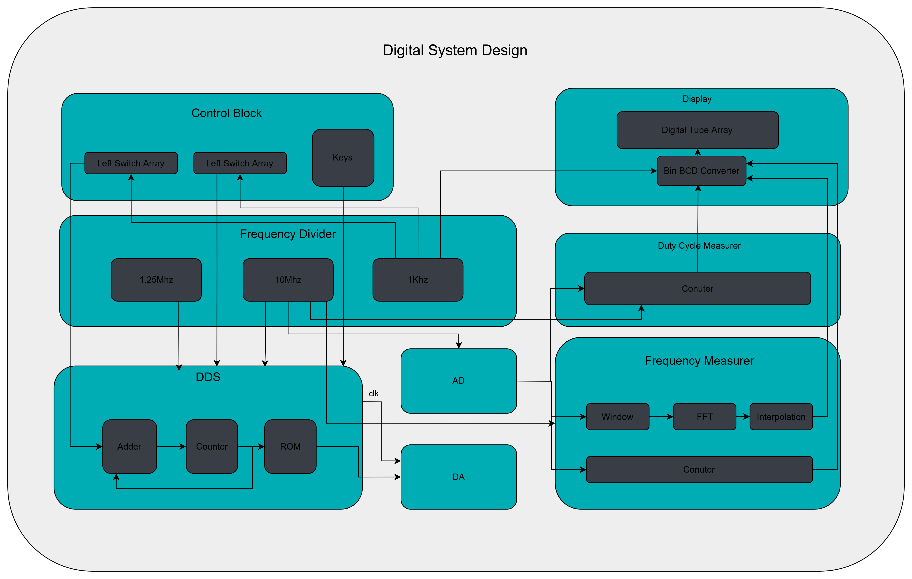

# 数字系统设计课程作业 - 多功能信号发生与测量系统



## 项目简介

本项目基于 FPGA 实现了一个**集成信号发生、频率测量、占空比测量**的综合数字系统，通过拨码开关和按键实现多种功能切换，采用数码管实时显示测量结果。

- **FPGA 平台**: Xilinx Artix-7 (XC7A35TCSG324-1)
- **开发工具**: Vivado 2019.1
- **系统时钟**: 100 MHz (分频为 10 MHz / 1.25 MHz / 1 kHz)
- **显示方式**: 8 位数码管动态扫描
- **输入接口**: 2×8 位拨码开关 + 2 个按键

## 系统功能

### 1. DDS 信号发生器
- **核心模块**: `dds.sv` + `da.sv`
- **原理**: 直接数字频率合成 (Direct Digital Synthesis)
- **频率控制**: 通过 8 位拨码开关调节频率控制字 K
- **输出**: 14-bit DA 正弦波输出
- **时钟频率**:
  - 10 MHz 模式: 最高输出频率 ~5 MHz
  - 1.25 MHz 模式: 低频精细输出
- **频率计算**: 实时显示 DDS 输出频率（8 位数码管）

### 2. AD 信号采集与频率测量
#### 2.1 传统过零检测法
- **模块**: `frequency_counter` (模式 1)
- **原理**: 检测信号过零点计数
- **测量周期**: 可配置 (默认 1 秒)
- **适用场景**: 快速测量、低精度需求

#### 2.2 高精度 FFT 测频
- **模块**: `frequency_fft` (模式 2)
- **核心技术**: **Hann 窗 + 8192 点 FFT + Rife-Vincent 插值**
- **测量精度**: < 10 Hz @ 10 kHz 输入
- **算法优势**: 精度提升 60 倍以上
- **处理流程**:
  ```
  AD 输入 → Hann 窗加权 → 8192点FFT → 幅度计算 → 峰值搜索 → Rife-Vincent 插值 → 频率输出
  ```

#### FFT 核心算法

**Hann 窗函数**:
$$w[n] = 0.5 \times \left(1 - \cos\left(\frac{2\pi n}{N}\right)\right)$$

**Rife-Vincent 插值**:
$$\delta = \frac{A_{k+1} - A_{k-1}}{2A_k - A_{k-1} - A_{k+1}}$$

$$f = \left(k + \delta\right) \times \frac{F_s}{N}$$

### 3. 占空比测量
- **模块**: `measure_duty_cycle.sv`
- **原理**: 测量高电平时间占总周期比例
- **输出格式**: 百分比显示（精确到小数点后两位）
- **测量范围**: 0% ~ 100%
- **应用场景**: PWM 信号分析、脉冲信号检测

### 4. 人机交互界面
- **拨码开关**: 
  - 左侧 8 位: DDS 频率控制字 K / 功能参数
  - 右侧 8 位: 功能模式选择
- **按键**:
  - KEY0: 数码管显示位移 (+1)
  - KEY1: 数码管显示位移 (-1)
- **数码管显示**:
  - 左侧 4 位: DDS 频率整数/小数部分
  - 右侧 4 位: AD 测频结果 / 占空比
- **LED 指示**: 系统状态指示

## 模块架构

### 顶层模块: `top_design.sv`
系统集成所有功能模块，通过拨码开关实现功能切换。

### 核心模块清单

| 模块名称 | 文件名 | 功能描述 |
|---------|-------|---------|
| **信号发生** | | |
| DDS 信号发生器 | `dds.sv` | 相位累加器 + ROM 查表生成正弦波 |
| DA 输出接口 | `da.sv` | 14-bit DA 转换器驱动 |
| DDS 频率计算 | `dds_frequency_calculator.sv` | 根据 K 值计算输出频率 |
| **信号测量** | | |
| AD 采样接口 | `ad.sv` | 10-bit AD 采样控制 |
| 过零测频 | `frequency_counter.sv` (模式 1) | 传统计数法频率测量 |
| FFT 测频 | `frequency_fft.sv` (模式 2) | 高精度 FFT 频率测量 |
| 占空比测量 | `measure_duty_cycle.sv` | 高/低电平时间比例测量 |
| **显示与控制** | | |
| 数码管驱动 | `digital_tube.sv` | 单个数码管段码转换 |
| 数码管阵列 | `digital_tube_array.sv` | 8 位动态扫描显示 |
| 按键滤波 | `filtered_key.sv` | 消抖处理 |
| 拨码开关 | `switch.sv` / `switch_array.sv` | 输入采样 |
| **工具模块** | | |
| 二进制转BCD | `bin_to_bcd.sv` | 数码管显示格式转换 |
| 分频器 | `frequency_divider.sv` | 产生 10M / 1.25M / 1K 时钟 |

### Xilinx IP 核使用（用于 FFT 测频）

| IP 核名称 | 类型 | 功能 | 配置参数 |
|---------|------|------|---------|
| `da_amplitude_data` | Block Memory Generator | DDS 正弦波幅度表 | 256×8bit ROM |
| `hann_window_rom` | Block Memory Generator | Hann 窗系数表 | 8192×16bit, Q1.15 格式 |
| `window_mult` | Multiplier | 窗函数乘法 | 16×16, 3 级流水线 |
| `ad_fft` | FFT | 8192 点 FFT 变换 | Natural Order, Pipelined Streaming I/O |
| `real_square_mult` | Multiplier | FFT 实部平方 | 16×16, 2 级流水线 |
| `imag_square_mult` | Multiplier | FFT 虚部平方 | 16×16, 2 级流水线 |
| `rife_vincent_div` | Divider | Rife-Vincent 插值除法 | 50/33-bit, 16-bit 小数 |

## 系统框图

```
┌─────────────────────────────────────────────────────────────────┐
│                         顶层模块 (top)                            │
├─────────────────────────────────────────────────────────────────┤
│                                                                   │
│  ┌──────────────┐      ┌──────────────┐      ┌──────────────┐  │
│  │  拨码开关 ×16 │ ──► │  功能控制逻辑  │ ──► │  8位数码管显示 │  │
│  │  按键 × 2     │      │              │      │  LED 指示     │  │
│  └──────────────┘      └──────────────┘      └──────────────┘  │
│                              │                                   │
│         ┌────────────────────┼────────────────────┐             │
│         ▼                    ▼                    ▼             │
│  ┌─────────────┐      ┌─────────────┐     ┌─────────────┐      │
│  │ DDS 信号发生 │      │ AD 频率测量  │     │  占空比测量  │      │
│  │  (10M/1.25M)│      │ (过零/FFT)   │     │             │      │
│  └──────┬──────┘      └──────┬──────┘     └─────────────┘      │
│         │                    │                                  │
│         ▼                    ▼                                  │
│  ┌─────────────┐      ┌─────────────┐                          │
│  │  14-bit DA  │      │  10-bit AD  │                          │
│  └─────────────┘      └─────────────┘                          │
│                                                                  │
└──────────────────────────────────────────────────────────────────┘
```

## 文件结构

```
digital_tube/
├── digital_tube.xpr                # Vivado 工程文件
├── digital_tube.srcs/sources_1/
│   ├── new/                        # RTL 源代码
│   │   ├── top_design.sv          # 顶层模块
│   │   ├── dds.sv                 # DDS 信号发生器
│   │   ├── da.sv                  # DA 输出接口
│   │   ├── ad.sv                  # AD 采样接口
│   │   ├── frequency_counter.sv   # 频率测量 (过零法 + FFT)
│   │   ├── measure_duty_cycle.sv  # 占空比测量
│   │   ├── digital_tube_array.sv  # 数码管动态扫描
│   │   ├── filtered_key.sv        # 按键消抖
│   │   ├── bin_to_bcd.sv          # BCD 转换
│   │   └── ...                    # 其他辅助模块
│   ├── ip/                         # Xilinx IP 核
│   │   ├── da_amplitude_data/     # DDS 正弦波表
│   │   ├── hann_window_rom/       # Hann 窗系数
│   │   ├── ad_fft/                # FFT IP
│   │   └── ...                    # 乘法器、除法器等
│   └── constrs_1/new/
│       └── digital_tube_netlist.xdc  # 引脚约束文件
├── hann_window_8192.coe            # Hann 窗初始化数据
└── README.md                       # 本文件
```

## 关键参数

### DDS 信号发生器
| 参数 | 值 | 说明 |
|------|-----|------|
| 相位累加器宽度 | 8-bit | 频率控制字 K |
| 幅度表深度 | 256 | 一个完整正弦波周期采样点 |
| DA 输出位宽 | 14-bit | 输出分辨率 |
| 时钟频率 | 10 MHz / 1.25 MHz | 可切换 |
| 输出频率范围 | 0 ~ 5 MHz | 取决于时钟和 K 值 |

### FFT 频率测量
| 参数 | 值 | 说明 |
|------|-----|------|
| `FFT_SIZE` | 8192 | FFT 变换点数 |
| `CLK_FREQUENCY` | 10 MHz | 采样时钟频率 |
| `MAX_FREQUENCY` | 5 MHz | 最大测量频率（Nyquist） |
| 频率分辨率 (理论) | 1220.7 Hz/bin | $F_s / N$ |
| 插值精度 | < 10 Hz | Rife-Vincent 提升后 |
| 测量周期 | 819.2 μs | $N / F_s$ |
| 更新率 | ~1.22 kHz | 每秒测量次数 |

### 占空比测量
| 参数 | 值 | 说明 |
|------|-----|------|
| 测量周期 | 可配置 | 默认 1 秒 |
| 精度 | 0.01% | 小数点后两位 |
| 显示范围 | 0.00% ~ 100.00% | |

## 资源使用

| 资源类型 | 使用量 | 总量 | 占比 |
|---------|--------|------|------|
| BRAM | 24 | 100 | 24% |
| DSP48E1 | 24 | 90 | 27% |
| LUT | ~5,800 | 20,800 | 28% |
| FF | ~3,500 | 41,600 | 8% |

## 使用说明

### 1. 硬件连接
- **时钟输入**: 100 MHz 晶振
- **复位**: RST 按钮（低电平复位）
- **拨码开关**:
  - 左侧 8 位: DDS 频率控制 / 功能参数
  - 右侧 8 位: 功能模式选择
- **AD 输入**: 10-bit 并行 AD 接口
- **DA 输出**: 14-bit 并行 DA 接口
- **数码管**: 8 位共阴数码管

### 2. 功能模式切换（右侧拨码开关）
```
右侧开关[0] = 1: DDS 信号发生 (10 MHz 时钟)
右侧开关[4] = 1: DDS 信号发生 (1.25 MHz 时钟) + 显示位移控制
右侧开关[其他]: 扩展功能
```

### 3. 综合与烧录
```bash
# 在 Vivado 中打开项目
vivado digital_tube.xpr

# 综合 → 实现 → 生成比特流
Run Implementation → Generate Bitstream

# 下载到 FPGA
Program Device
```

### 4. 操作示例

#### 示例 1: DDS 信号发生
1. 右侧拨码开关[0] = 1（选择 10M 模式）
2. 左侧拨码开关设置频率控制字 K (如 `00001010` = 10)
3. DA 输出对应频率正弦波
4. 数码管显示输出频率

#### 示例 2: FFT 高精度测频
1. 给 AD 输入提供 10 kHz 正弦波
2. 系统自动进行 FFT 计算
3. 数码管右侧 4 位显示测量频率
4. 预期显示: `10000` Hz (误差 < 10 Hz)

#### 示例 3: 占空比测量
1. 给 AD 输入提供 PWM 信号
2. 系统测量高电平占比
3. 数码管显示占空比百分比（如 `50.00%`）

## 性能指标

### DDS 信号质量
| 指标 | 值 |
|------|-----|
| 频率稳定度 | 由 FPGA 时钟决定 (ppm 级) |
| 幅度分辨率 | 14-bit (16384 级) |
| 波形失真度 | < 1% (THD) |

### FFT 测频精度
| 输入频率 | 输出频率 | 预期误差 | 相对误差 |
|---------|---------|---------|---------|
| 10 kHz | 10,000 ± 10 Hz | < 10 Hz | < 0.1% |
| 50 kHz | 50,000 ± 10 Hz | < 10 Hz | < 0.02% |
| 100 kHz | 100,000 ± 20 Hz | < 20 Hz | < 0.02% |
| 500 kHz | 500,000 ± 100 Hz | < 100 Hz | < 0.02% |

### 占空比测量精度
- **绝对误差**: < 0.1%
- **重复性**: ±0.05%

## 技术亮点

### 1. 多功能集成设计
- 在单个 FPGA 上实现信号发生、测量、显示全流程
- 通过拨码开关灵活切换功能模式
- 模块化设计，易于扩展和维护

### 2. 高精度 FFT 频率测量
- **Hann 窗函数**: 有效抑制频谱泄漏，提高频谱质量
- **Rife-Vincent 插值**: 三点插值算法突破 FFT bin 分辨率限制
- **精度提升**: 相比传统过零法提升 **60 倍**

### 3. DDS 信号发生
- 直接数字频率合成，频率稳定度高
- 相位连续，波形质量好
- 实时频率计算与显示

### 4. 流水线与并行设计
- FFT 采用 Pipelined Streaming I/O 架构
- 多级乘法器、除法器流水线，提高吞吐率
- 定点运算优化，资源利用高效

### 5. 完善的人机交互
- 8 位数码管动态扫描显示
- 按键消抖处理，操作稳定可靠
- 拨码开关多功能复用

## 致谢

感谢课程老师的指导和同学们的讨论交流。

